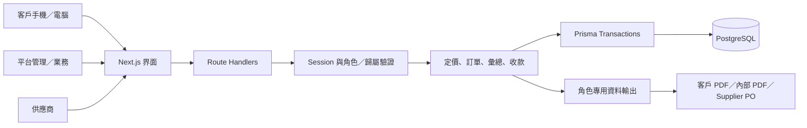

# 系統架構

DongmenSeafoodHub 採用 Next.js App Router、React、TypeScript、Tailwind CSS、Prisma 6 與真正的 PostgreSQL。手機優先的客戶介面與管理操作共用後端服務，但在 API 資料出口明確分開角色資料。

## 核心邊界

- `lib/server/auth.ts`：bcrypt 密碼雜湊、伺服器 Session、Cookie、角色檢查、寫入來源與 JSON Content-Type 檢查、登入失敗限制。
- `lib/server/domain.ts`：Decimal 金額計算、專屬價格優先、價格等級模式、佣金／返佣、訂單狀態轉換與歸屬判斷。
- `lib/server/data.ts`：以角色與 customerId／supplierId 篩選；輸出白名單 DTO，不把 Prisma 整個資料模型交給客戶。
- 交易服務：提交訂單時重新確認商品與價格，保留不可由客戶修改的快照；彙總保留一筆訂單明細只能有一筆配貨分配的資料庫約束。
- 文件服務：`order`、`admin-order`、`po`、`quotation` 分開授權，PDF 與列印不能靠前端 CSS 隱藏敏感欄位。

## 訂單與集中採購

`SUBMITTED → CONFIRMED → ORDERED_TO_SUPPLIER → PREPARING → SHIPPED → DELIVERED → COMPLETED`。早期狀態可依允許轉換取消，進入供應商採購後不提供任意倒退。重複提交用 customerId＋idempotencyKey 防止新增重複訂單；每日流水號由資料庫維護。

Supplier PO 依 Supplier＋SKU 彙總，保留各客戶配貨數量、送貨地點與聯絡窗口。供應商只能看到成本及履約必需資料，不能看到客戶成交價、平台毛利或其他供應商資訊。

`DROP_SHIP` 只記錄可供貨／缺貨與供應商狀態，不扣減不存在的平台實體庫存。`OWN_STOCK` 未啟用。

## 安全與發布保護

Session token 只以雜湊存於資料庫；Cookie 設 HttpOnly、SameSite，在 production 使用 Secure。正式環境必須 HTTPS。API 有伺服器角色／歸屬檢查；前端路由或按鈕顯示不是安全邊界。

供應商文案匯入須環境授權旗標與最高管理員確認。非 Demo 的商品公開另依平台法律資料完整與發布閘門；未授權圖片不出現在 DTO。記錄敏感操作 old/new 值；應用程式無稽核記錄修改／刪除入口。

本機 Demo 安全控制不取代正式安全稽核。正式部署仍須 TLS、最低權限 DB 帳號、備份恢復演練、監控、存取與稽核留存政策、上傳檔案大小限制、隱私保存期限與滲透測試。

## 非同步擴充

`NotificationOutbox` 預留 LINE 等通知事件，目前 `DISABLED`，不會發送訊息。未串接金流、物流、會計、ERP 或 POS；也不自動向真實供應商送出採購文件。供應商登入與 PDF 可先支援人工確認流程。
