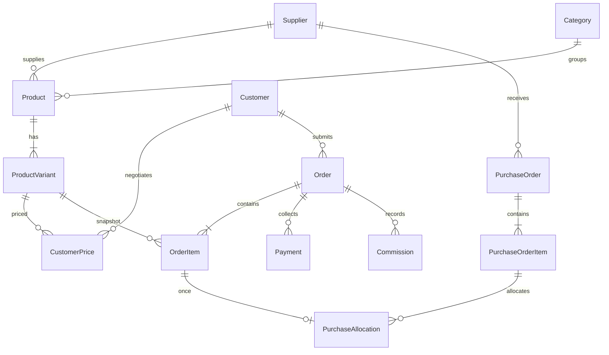

# PostgreSQL 資料庫

完整定義以 [`prisma/schema.prisma`](prisma/schema.prisma) 為準；migrations 存於 `prisma/migrations/`。金額主要採 `Decimal(14,2)`，比例主要採 `Decimal(7,4)`；計算使用 Decimal，避免二進位浮點金額誤差。API 出口才轉換顯示用數值。

## 主要模型

| 模型 | 用途與核心關係 |
| --- | --- |
| User／Session／LoginAttempt | 四種角色、customer／supplier 歸屬、雜湊 Session token 與登入限制 |
| Customer | 公司／攤位／市場、聯絡資料、LINE、統編、發票、配送、客戶類型、價格等級、業務與帳期 |
| Supplier | 供應商、聯絡方式、網站、授權狀態、採購金額議價目標、商品、階梯與採購單 |
| Category | 資料庫管理的分類；不把分類寫死在前端 |
| Product | 來源、原始識別碼、授權、介紹、保存、圖片、供貨狀態 |
| ProductVariant | 各 SKU 獨立規格、重量、單位、箱入數、MOQ、成本／售價與佣金設定 |
| PriceLevel | SKU＋等級唯一，FIXED／COST_PLUS／MARGIN 定價 |
| CustomerPrice | 客戶＋SKU 專屬售價與有效期間 |
| VolumeTier | 供應商數量門檻、折扣、佣金、返佣 |
| Order／OrderItem | 客戶採購與每項商品的不可回溯定價快照 |
| PurchaseOrder／PurchaseOrderItem | 各供應商集中採購與 SKU 彙總數量／成本 |
| PurchaseAllocation | 訂單明細→採購明細分配；orderItemId 唯一防止重複採購 |
| Payment | 收款金額、方式、日期、對帳參考與備註 |
| Commission | 供應商＋訂單佣金台帳，PENDING／CONFIRMED／PAID |
| Favorite | 每個客戶的 SKU 收藏，customerId＋variantId 唯一 |
| Quotation | 客戶報價、有效日期、交易／配送條件與 JSON 明細快照 |
| AuditLog | 操作者、動作、實體、old/new 與時間 |
| PlatformSetting | 商業模式、服務費、法律／營業資料與正式發布確認 |
| DailySequence | 每日交易文件流水號 |
| NotificationOutbox | 未啟用的未來通知管道預留 |

## 關聯概覽



## 快照與帳務

OrderItem 下單時保存 supplierCostSnapshot、customerPriceSnapshot、commissionRateSnapshot、commissionAmountSnapshot，另保存返佣、商品名稱、SKU、規格、單位與數量；之後調整 ProductVariant／CustomerPrice 不改變舊訂單。Order 保存當時商業模式、總額、成本、毛利、佣金、服務費、付款與配送資訊。

正式 schema 的佣金比例、服務費與 Supplier.negotiationTargetAmount 預設為零。Demo seed 的測試比例與目標是另外明確設定，並非真實商業條件。金額議價目標僅供 KPI，不是自動金額返佣規則。

Supplier PO 保存彙總成本及配貨明細；客戶售價不輸出到供應商文件。收款以多筆 Payment 累計，不直接由前端覆寫已收總額。付款狀態與逾期可由應付日與已收金額計算。

稽核在交易成功時記錄，應用層不暴露更新或刪除稽核的 API。這不是防資料庫最高權限竄改的帳本；正式環境須另設專用權限、備份、監控與外部留存。

## 本機維護

```powershell
npm run db:start
npm run db:migrate
npm run db:seed
npm run db:studio
npm run db:stop
```

本機資料置於 `.runtime/postgres`，啟停腳本先核對 workspace marker 與 PostgreSQL `data_directory`，不刪除資料，不接管其他服務。不要搬動執行中的資料目錄；不要把 `.runtime`、`.env` 或備份提交至版控。正式備份請使用適合該部署環境的 PostgreSQL 備份工具並驗證還原。
